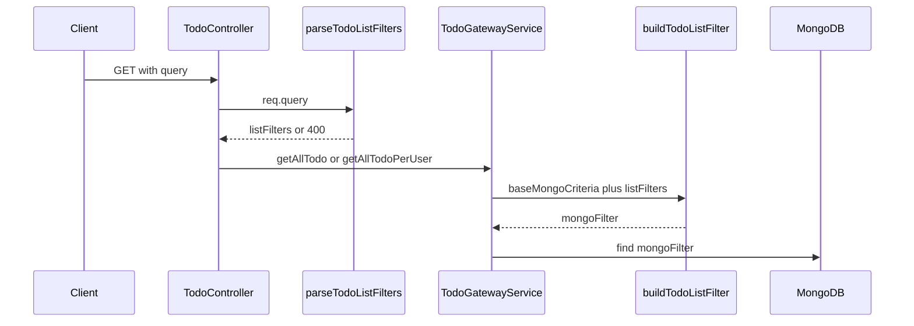

# Todo list filters

Optional query parameters on the **todo list** endpoints filter results by **text** (`title` / `description`) and/or **status**. There is no separate config file: accepted param names and behavior live in [`src/utils/todo/todo-list-query.utils.ts`](../src/utils/todo/todo-list-query.utils.ts).

- Empty result sets return **HTTP 200** with `data: []` (not 404).
- Invalid `status` returns **HTTP 400** with a JSON body listing allowed values.

Other todo routes (create, update, delete, get-by-id) are not covered here.

---

## Endpoints

Assume base URL `http://localhost:3000` (or `process.env.PORT` from [`src/index.ts`](../src/index.ts)).

| Method | Path | Scope |
|--------|------|--------|
| `GET` | `/todo/` | All todos |
| `GET` | `/todo/all-per-user/:userId` | Todos where `assigned_to` equals `:userId` |

Both support the same optional **query string** parameters below.

---

## Query parameters

| Name | Required | Behavior |
|------|----------|----------|
| `query_string` | No | First value is taken (see `firstQueryParam`); trimmed. If missing or empty after trim, **no text filter**. Search is case-insensitive substring match on **`title`** OR **`description`**. Regex special characters in the input are **escaped** server-side so the search is literal, not a user regex. |
| `status` | No | Trimmed. If missing or empty, **all statuses**. If set, must exactly match a todo status enum value (including **`in progress`** with a space). Otherwise **400**. |

Allowed `status` values (from [`src/model/todo-model.ts`](../src/model/todo-model.ts) `TODO_STATUS_VALUES`):

`pending`, `in progress`, `completed`, `cancelled`, `deleted`

---

## Code map

| Concern | Location |
|---------|----------|
| Read `req.query`, validate `status`, build `TodoListFilters` | `parseTodoListFilters`, `firstQueryParam` in [`todo-list-query.utils.ts`](../src/utils/todo/todo-list-query.utils.ts) |
| Parsed filter shape | Exported type `TodoListFilters` in same file (`query_string?`, `status?`) |
| Merge base scope + filters → Mongo `find` filter | `buildTodoListFilter` in same file |
| Call parse + gateway | [`todo.controller.ts`](../src/controllers/todo.controller.ts) `getAll`, `getAllTodoPerUser` |
| `find` + sort | [`todo-gateway-service.ts`](../src/services/todo-gateway-service.ts) `getAllTodo`, `getAllTodoPerUser` |

---

## `baseMongoCriteria` (fixed scope)

`buildTodoListFilter(baseMongoCriteria, listFilters)` starts from **immutable scope** for that list call, then applies optional `listFilters`.

- **`GET /todo/`** → `baseMongoCriteria` is `{}` (no extra mandatory match).
- **`GET /todo/all-per-user/:userId`** → `baseMongoCriteria` is `{ assigned_to: userId }`.

Then, if present in `listFilters`:

- `status` → adds `status: <value>`.
- `query_string` → adds `$or` on `title` and `description` with `$regex` + `$options: 'i'`.

So: **base = who/what slice of the collection**; **list filters = UI-driven narrowing** inside that slice.

---

## Request flow



---

## Sample requests (cURL)

Replace `USER_ID` with a real Mongo user id string. Adjust host/port if needed.

**No filters (all todos for user)**

```bash
curl -s "http://localhost:3000/todo/all-per-user/USER_ID"
```

**Search text only**

```bash
curl -s "http://localhost:3000/todo/all-per-user/USER_ID?query_string=invoice"
```

**Status only (`in progress` must be URL-encoded)**

```bash
curl -s "http://localhost:3000/todo/all-per-user/USER_ID?status=in%20progress"
```

**Combined search + status**

```bash
curl -s "http://localhost:3000/todo/all-per-user/USER_ID?query_string=draft&status=pending"
```

**Global list with filters**

```bash
curl -s "http://localhost:3000/todo?query_string=release&status=completed"
```

---

## Sample requests (JavaScript `fetch`)

```javascript
const base = 'http://localhost:3000';
const userId = 'USER_ID';

// No filters
await fetch(`${base}/todo/all-per-user/${userId}`);

// query_string only
await fetch(`${base}/todo/all-per-user/${userId}?${new URLSearchParams({ query_string: 'invoice' })}`);

// status only (URLSearchParams encodes spaces)
await fetch(`${base}/todo/all-per-user/${userId}?${new URLSearchParams({ status: 'in progress' })}`);

// Combined
await fetch(
  `${base}/todo/all-per-user/${userId}?${new URLSearchParams({
    query_string: 'draft',
    status: 'pending',
  })}`,
);
```

---

## Sample JSON responses

### 200 — success with todos

Shape from the controller: `success`, `message`, `data` (array of todo documents).

```json
{
  "success": true,
  "message": "Todos fetched successfully",
  "data": [
    {
      "_id": "67ed1a2b3c4d5e6f7890abcd",
      "created_at": "2026-04-21T10:00:00.000Z",
      "updated_at": "2026-04-21T10:00:00.000Z",
      "deleted_at": null,
      "completed_at": null,
      "created_by": "67ed00000000000000000001",
      "title": "Invoice draft",
      "description": "Send draft to finance by Friday.",
      "deadline": "2026-04-25T17:00:00.000Z",
      "status": "pending",
      "assigned_to": "67ed00000000000000000002"
    }
  ]
}
```

### 200 — no rows match (including when filters match nothing)

```json
{
  "success": true,
  "message": "Todos fetched successfully",
  "data": []
}
```

### 400 — invalid `status`

```json
{
  "success": false,
  "message": "Invalid status. Allowed values: pending, in progress, completed, cancelled, deleted"
}
```

---

## Illustrative Mongo filter (not an API response)

The API does not return this object; it approximates what `TodoModel.find(mongoFilter)` uses after `buildTodoListFilter` for **per-user** + **status** + **query_string**.

**Conceptual** (regex shown as `/pattern/i` for readability):

```javascript
{
  assigned_to: "67ed00000000000000000002",
  status: "pending",
  $or: [
    { title: { $regex: "invoice", $options: "i" } },
    { description: { $regex: "invoice", $options: "i" } },
  ],
}
```

If the user had typed `a+b`, the stored pattern would escape `+` so it matches a literal plus, not regex syntax. Sort is always `{ created_at: -1 }` in the gateway.

---

## Client notes

- Product copy “search by **name**” maps to the todo field **`title`** (and **`description`**) on the server.
- Send **`status`** only when the dropdown has a concrete value; omit or leave empty for “all statuses”.
- Debounce **`query_string`** requests while the user types to reduce load.
- Encode **`in progress`** in URLs as `in%20progress` when building query strings manually.
